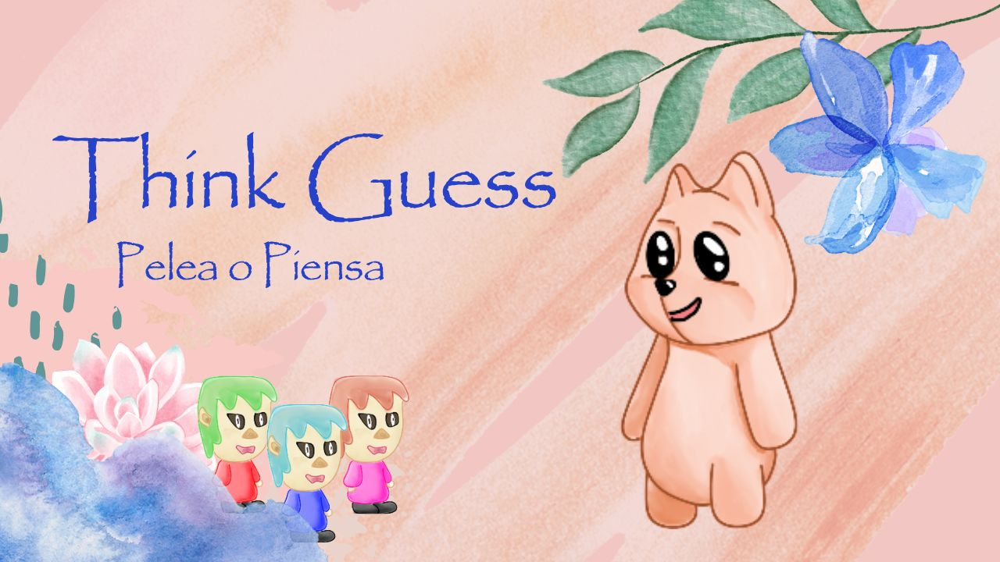

# ThinkGuess

ThinkGuess es un juego desarrollado en Python utilizando la librería PyGame. El objetivo del juego es resolver laberintos mientras enfrentas acertijos desafiantes de tus enemigos. ¡Pon a prueba tus habilidades lógicas y tu destreza para completar cada nivel!

- **Laberintos interactivos**: Navega por laberintos diseñados para retar tus habilidades.
- **Acertijos dinámicos**: Resuelve acertijos únicos mientras avanzas en el juego.
- **Menús intuitivos**: Un diseño simple y atractivo que te guía por las opciones.
- **Enemigos desafiantes**: Esquiva a los enemigos mientras encuentras la salida del laberinto.
- **Progresión de niveles**: ¡Laberintos de diferentes niveles de dificultad infinitos!

## Modo de Juego

A través del juego podrás encontrar diferentes laberintos por resolver. Al llegar a la puerta, podrás ingresar a un laberinto completamente nuevo. A través del laberinto encontrarás enemigos. Para seguir jugando, necesitas resolver el asertijo que te proponen o combatir contra ellos.

* Si decides combatir con tu enemigo, cada bala baja tu vida en un porcentaje definido de acuerdo con el color de este.
* Si resuelves el acertijo, no necesitas combatir y curarás un poco de tu vida.
* Si pierdes un combate ¡Ops! Habrás acabado el juego :c (Game Over)
* Si resuelves un asertijo o ganas un combate, podrás seguir solucionando el laberinto.

¡Resuelve tantos laberintos como puedas!

### ¡Juega!

Utiliza los siguientes controles para jugar:

* Flechas -> para moverte a través del laberinto o de la zona de combate.
* Espacio -> para lanzar proyectiles hacia tu enemigo.
* Enter -> para comenzar a jugar o para aceptar menús del juego.
* Tab -> para comenzar un combate con tu enemigo.
* ESC -> para salir del juego.

¡¡Tip!!
En los asertijos encontrarás unas líneas, estas coniciden con el número de letras que contiene la respuesta correcta del asertijo. ¡Siempre será una sola palabra!


## Requisitos

- Python 3.8 o superior.
- Librería PyGame (puedes instalarla con `pip install pygame`).

## Instalación y Ejecución

1. Clona el repositorio o descarga los archivos del proyecto.
```bash
   git clone https://github.com/Paula2208/ThinkGuess.git
```

2. Asegúrate de tener Python y PyGame instalados:

```bash
   pip install pygame
```

3. Ejecuta el archivo principal del juego:

```bash
   python main.py
```

